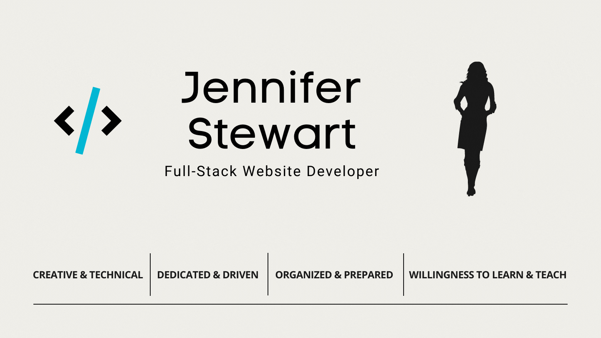

## Hello! I'm Jen... 
### I started learning Web Development as a hobby in 2016. After completing my first project I was hooked! I enrolled and graduated from Bloom Institute of Technology (formerly Lambda School) in December of 2020 (6 month bootcamp). My passion is developing amazing user experiences! There is always more to learn, and plenty to teach in Development... hard work pays off!

### Please take a moment to find out more about me at my portfolio [website]. 

### Connect with me on [Linkedin] ☺️

 

- 👯 I love working with teams of awesome Developers!
- ♡ My favorite quote is “For every minute you are angry you lose sixty seconds of happiness.” ― Ralph Waldo Emerson
- 🤓 I believe code should be short, clean, concise and well-documented. 
- 🥅 2023 Goals: Learn Typescript, more about AWS and start working on a new big personal project!
- ⚡ Fun fact: Prior to becoming a Developer I worked in the Healthcare Administration field for a Fortune 25 company.

 

### Languages and Tools:

 

[website]: https://jenstewart.net
[codepen]: https://codepen.io/jen-stewart
[linkedin]: https://www.linkedin.com/in/jen-stewart-feb
[instructables]: https://www.instructables.com
