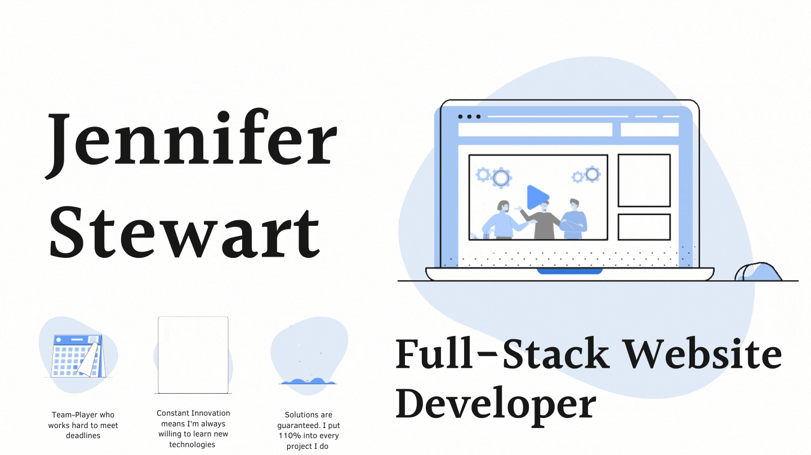

## Hello! I'm Jen... please take a moment to find out more about me at my portfolio [website] 👋

### Or you can connect with me at [Linkedin] ☺️
### Feel free to look over my [Resume] ☺️

 

### I am currently a Student at [Lambda] Coding School

- 🤓 I’m currently studying Computer Science
- 👯 I’m looking to collaborate with other content creators
- 🥅 2020 Goals: Contribute more to Open Source projects
- ⚡ Fun fact: I love electronics, and often make projects from my favorite hobby website [instructables]

 

### Languages and Tools:

 

[website]: https://jstewart-portfolio-bootstrap.vercel.app
[codepen]: https://codepen.io/jen-stewart
[linkedin]: https://www.linkedin.com/in/jennifer-stewart-39aa5759
[lambda]: https://lambdaschool.com
[Resume]: https://docs.google.com/document/d/1leMUor-Vdi7K9tUuE-tEua-QId31FcUiLSz-X4Coeeg/edit?usp=sharing
[instructables]: https://www.instructables.com
